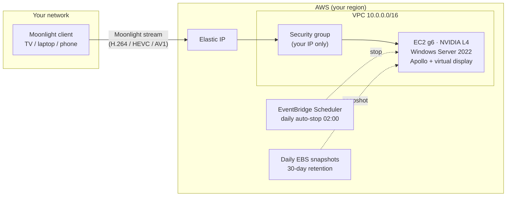

# Cloud Gaming on AWS EC2

Deploy your own cloud gaming rig on AWS: an EC2 **g6** GPU instance (NVIDIA L4, 24 GB VRAM)
with **Windows Server 2022** and **[Apollo](https://github.com/ClassicOldSong/Apollo)** (a
Sunshine fork with a built-in virtual display), streamed to any
**[Moonlight](https://moonlight-stream.org/)** client — TV, laptop, phone, or tablet.

One `./deploy-apollo.sh` builds the whole stack: VPC, GPU instance, licensed NVIDIA gaming
driver, Apollo, Steam, GOG Galaxy, virtual audio, gamepad driver, Elastic IP, daily auto-stop,
and daily EBS snapshots. Only store logins and game installs stay manual
(see [AUTOMATION.md](AUTOMATION.md)).



## Prerequisites

1. **GPU quota — request this first.** Fresh AWS accounts have a quota of **0 vCPUs** for
   "Running On-Demand G and VT instances". You cannot launch any GPU instance until you raise
   it. Request an increase to **8 vCPUs** (enough for `g6.2xlarge`) in the Service Quotas
   console → EC2 → "Running On-Demand G and VT instances", **in the region you will deploy
   to**. Approval is usually fast but can take up to a couple of days — do this before
   anything else. An approved quota is not a capacity guarantee.
2. An AWS account with permissions to deploy the stack: CloudFormation, EC2/VPC, IAM role
   creation (`CAPABILITY_IAM`), SSM, EventBridge Scheduler, and Data Lifecycle Manager.
3. AWS CLI v2 with working credentials — any style: `aws configure`, SSO (`aws sso login`),
   or environment variables.
4. `bash` and `curl` (macOS, Linux, or Windows WSL). `python3` for the two optional
   config/monitoring scripts.
5. A [Moonlight client](https://moonlight-stream.org/) on your device.

## Costs — read before you deploy

| What | Approximate cost |
|---|---|
| Instance while playing (`g6.2xlarge`, Windows on-demand, eu-central-1) | ~$1.40–1.60/h |
| **Data transfer out while streaming** (~20 GB/h measured at 4K60) | **~$1.80/h on top** |
| EBS volume (100 GB gp3, default) | ~$10–15/month, billed also when stopped |
| Daily snapshots (30-day retention) + Elastic IP while instance is stopped | ~$10–15/month |

The data transfer cost is the surprise item: at 4K the stream itself can cost more than the
instance. Lower resolution/bitrate in Moonlight cuts it roughly proportionally.

> **Plan for a minimum of about $30/month in total.** The storage rows above bill every
> month, played or not, and even ~10 hours of play adds instance hours plus data transfer
> on top. The rig is cheap per hour — it is not free per month.

The stack stops the instance daily at 02:00 (`AUTO_STOP_TIMEZONE`) as a safety net. Do not
rely on it — run `./stop-gaming.sh` when you finish playing.

## Quickstart

```bash
git clone https://github.com/serverlesspolska/cloud-gaming.git
cd cloud-gaming
cp .envrc.example .envrc    # edit: set ADMIN_PASSWORD, optionally region/instance type
direnv allow                # or: source .envrc
./deploy-apollo.sh
```

The first deploy takes ~30 minutes (Windows boot, driver + software install, one reboot).
The script prints the stack outputs at the end, including the Elastic IP.

Then:

1. Open the Apollo web UI: `https://<ElasticIP>:47990` — user `admin`, password =
   `ADMIN_PASSWORD`. Accept the self-signed-certificate warning.
2. In Moonlight, add the host `<ElasticIP>` and start pairing. Enter the shown PIN in the
   Apollo web UI (PIN tab).
3. If the first app launch returns an HTTP 403 error, open the Apollo web UI and grant the
   new client its permissions. This is per-client, one time.
4. Optional: run `./apply-config.sh` to push the canonical config from `config/`
   (the advertised host name defaults to `Plotka` — edit `config/sunshine.conf` to change it).
5. Start the **Desktop** app in Moonlight, log in to Steam/GOG, and install your games.
   RDP also works (allowed from your IP) for keyboard-heavy setup work.

## Daily use

```bash
./start-gaming.sh    # boot the rig (~1 min), prints the connection info
./stop-gaming.sh     # stop it — billing for the instance stops too
```

If your home IP changed and Moonlight cannot connect, rerun `./deploy-apollo.sh`. It
re-detects your IP and updates the security group. This is safe: the AMI stays pinned, so
the instance is not replaced.

## Updating and upgrading

The Windows AMI is resolved to the newest Windows Server 2022 image **once**, on the first
deploy, and pinned in the stack from then on. Every later `./deploy-apollo.sh` reuses the
pinned AMI on purpose.

To move to a newer AMI deliberately: `IMAGE_ID=<ami-...> ./deploy-apollo.sh`.
**Warning: a changed `imageId` REPLACES the instance and deletes its disk — installed games
included.** Your latest EBS snapshot is the way back.

## Config as code

Apollo's two config files are versioned in `config/`:

- `./apply-config.sh` pushes them to the box via SSM and restarts Apollo.
  Do not run it while someone is playing. The restart drops the stream.
- `./dump-config.sh` pulls the live config into `config/live/` and shows the drift after
  web-UI experiments. Adopt the drift (`cp` + commit) or discard it (`./apply-config.sh`).

The most important field: every app tile needs `"virtual-display": true`. Tiles created in
the Apollo web UI default to `false`. The symptom is a client that shows the Windows desktop
while the game audio plays — the game runs on a phantom display.

## Monitoring (optional)

`./setup-monitoring.sh` installs the CloudWatch agent (RAM, disk, CPU) and a scheduled task
that publishes NVIDIA GPU metrics (utilization, power draw, encoder stats) every minute.
Namespace `CWAgent`. Cost: well under $1/month at a few gaming hours per day. Useful for
instance-size decisions (`Memory Available MBytes`) and stream tuning
(`nvidia_smi_power_draw` — the L4 caps at 72 W, pegged = power-limited).

## What stays manual

Store logins, game installs, Moonlight pairing, and the per-client permission grant.
[AUTOMATION.md](AUTOMATION.md) explains what is codified in which layer and why the rest is
manual. Daily EBS snapshots cover the manual state: a rebuild from a snapshot keeps logins,
games and settings.

## Security notes

- The security group admits only the IP detected at deploy time. The template default fails
  closed (`0.0.0.0/32` — no access) if the parameter is omitted.
- The Apollo web UI listens on the public Elastic IP, but the security group restricts it to
  your IP and the UI requires login.
- The administrator password reaches the instance through CloudFormation resource metadata
  (read by `cfn-init`) and is stored in the Windows autologon registry key. Anyone with
  CloudFormation **read** access in your account can recover it — use a dedicated password,
  never a reused one. `NoEcho` hides it from consoles, not from resource metadata.
- To rotate the password, change all three together: the Windows account (`net user`), the
  autologon registry value, and the Apollo web UI credentials (`sunshine.exe --creds`).

## Teardown

```bash
aws cloudformation delete-stack --stack-name apollo-gaming --region <your-region>
```

This deletes the instance, its disk (games and saves included), and the Elastic IP. One
thing survives on purpose and costs money until you remove it: **DLM snapshots are not
deleted with the stack.** Delete them in the EC2 console → Snapshots when you no longer
need a restore point.

## Gotchas / FAQ

- **Password rejected at deploy?** The template accepts only `@$!%*?&` as special characters
  (min 8 chars, with upper, lower, and digit). Generated passwords with other symbols fail
  the CloudFormation validation.
- **Windows 11 instead of Windows Server?** Not possible. Microsoft licensing forbids
  Windows 10/11 on shared-tenancy EC2. The Windows Server license is included in the
  on-demand price.
- **NVIDIA driver**: the gaming driver from `s3://nvidia-gaming` is licensed for use on EC2
  only. The bucket ships the latest build, so a fresh deploy can get a newer driver version
  than the last one you saw.
- **g6.xlarge or g6.2xlarge?** Same L4 GPU. `g6.xlarge` (4 vCPU / 16 GB) is fine for 1080p
  and costs ~35% less. `g6.2xlarge` (8 vCPU / 32 GB) is the safer choice for 4K.
- **DRM-free games (GOG)**: point the app tile's `cmd` directly at the game exe. Do not
  launch through GOG Galaxy.
- **First connection after pairing fails with 403**: expected — grant the client its
  permissions in the Apollo web UI.

## Credits

Based on [aws-samples/cloud-gaming-on-ec2-using-steam](https://github.com/aws-samples/cloud-gaming-on-ec2-using-steam)
(MIT-0) and the accompanying
[AWS GameTech blog post](https://aws.amazon.com/blogs/gametech/game-on-demand-unlocking-cost-efficient-cloud-gaming-with-amazon-ec2s-pay-as-you-go-model-using-steam/).
Apollo is by [ClassicOldSong](https://github.com/ClassicOldSong/Apollo); Moonlight by the
[Moonlight team](https://moonlight-stream.org/).

License: [MIT-0](LICENSE).
